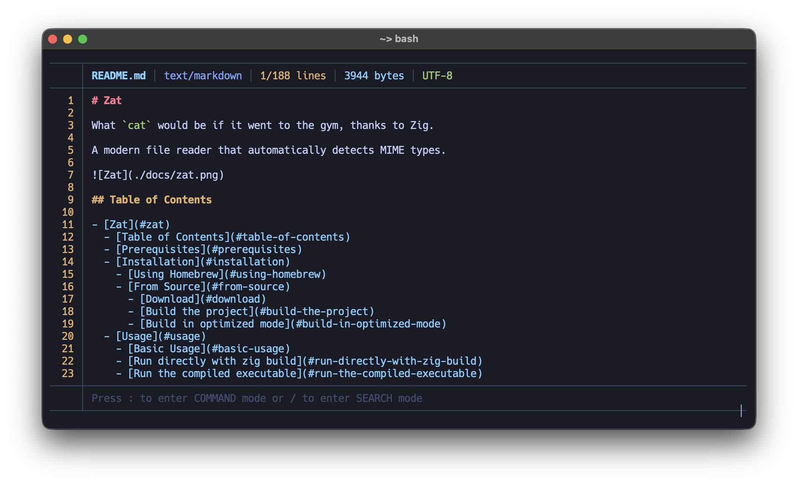

# Zat

What `cat` would be if it went to the gym, thanks to Zig.

A modern, interactive file viewer for the terminal with syntax highlighting, search, and vim-like keybindings.



## Features

- Syntax highlighting for 28+ languages
- Vim-like navigation (`j`/`k`, `/` search, `:` commands)
- Search with highlighted matches and `n`/`N` navigation
- MIME type detection
- Alternate screen (leaves your terminal clean on exit)
- Supports Linux and macOS

## Installation

### Homebrew (macOS / Linux)

```bash
brew install tun43p/tap/zat
```

### From releases

Download the latest binary from [Releases](https://github.com/tun43p/zat/releases), extract it, and add it to your `PATH`.

### From source

Requires [Zig](https://ziglang.org/download/) 0.15.2+.

```bash
git clone https://github.com/tun43p/zat.git
cd zat
zig build -Doptimize=ReleaseFast
```

The binary will be at `zig-out/bin/zat`. Optionally install it globally:

```bash
zig build install --prefix ~/.local
```

## Usage

```bash
zat <file>
```

## Keyboard Shortcuts

### Navigation

| Key                | Action         |
| ------------------ | -------------- |
| `j` / `Arrow Down` | Scroll down    |
| `k` / `Arrow Up`   | Scroll up      |
| `g`                | Go to top      |
| `G`                | Go to bottom   |
| `d`                | Half page down |
| `u`                | Half page up   |
| `Space`            | Page down      |

### Command Mode

| Key   | Action             |
| ----- | ------------------ |
| `:`   | Enter command mode |
| `Esc` | Exit command mode  |

| Command | Action                  |
| ------- | ----------------------- |
| `:q`    | Quit                    |
| `:help` | Show available commands |
| `:N`    | Go to line N            |

### Search Mode

| Key     | Action                        |
| ------- | ----------------------------- |
| `/`     | Enter search mode             |
| `Enter` | Confirm search                |
| `Esc`   | Cancel search / Clear results |
| `n`     | Jump to next match            |
| `N`     | Jump to previous match        |

## Contributing

See [CONTRIBUTING.md](CONTRIBUTING.md) for guidelines.

## License

MIT - See [LICENSE](LICENSE) for details.
