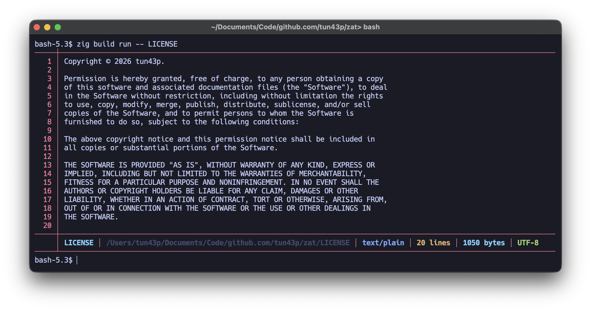

# Zat

`cat`, but written in Zig.

A modern file reader that automatically detects MIME types.



## Table of Contents

- [Zat](#zat)
  - [Table of Contents](#table-of-contents)
  - [Prerequisites](#prerequisites)
  - [Installation](#installation)
  - [Building](#building)
    - [Build the project](#build-the-project)
    - [Build in optimized mode](#build-in-optimized-mode)
  - [Usage](#usage)
    - [Run directly with zig build](#run-directly-with-zig-build)
    - [Run the compiled executable](#run-the-compiled-executable)
    - [Install globally (optional)](#install-globally-optional)
  - [Available Commands](#available-commands)
  - [Project Structure](#project-structure)
  - [Dependencies](#dependencies)
  - [Testing](#testing)
  - [Authors](#authors)
  - [License](#license)

## Prerequisites

- **Zig** version 0.15.2 or higher
  - Download Zig from [ziglang.org/download](https://ziglang.org/download/)
  - Check your version: `zig version`

## Installation

Clone the repository:

```bash
git clone https://github.com/tun43p/zat.git
cd zat
```

## Building

### Build the project

```bash
zig build
```

The executable will be generated in `zig-out/bin/zat`.

### Build in optimized mode

For an optimized (release) version:

```bash
zig build -Doptimize=ReleaseFast
```

Available optimization options:

- `Debug` (default) - No optimization, with debug symbols
- `ReleaseSafe` - Optimized with safety checks
- `ReleaseFast` - Optimized for speed
- `ReleaseSmall` - Optimized for size

## Usage

### Run directly with zig build

```bash
zig build run -- [file]
```

Example:

```bash
zig build run -- src/main.zig
```

### Run the compiled executable

```bash
./zig-out/bin/zat [file]
```

Example:

```bash
./zig-out/bin/zat README.md
```

### Install globally (optional)

To install the executable on your system:

```bash
zig build install --prefix ~/.local
```

Then add `~/.local/bin` to your PATH if not already done.

## Available Commands

- `zig build` - Build the project
- `zig build run -- [args]` - Build and run the project with arguments
- `zig build test` - Run tests
- `zig build -Doptimize=ReleaseFast` - Build in optimized release mode

## Project Structure

```text
zat/
├── build.zig          # Zig build configuration
├── build.zig.zon      # Dependency manager
├── src/
│   ├── main.zig       # Application entry point
│   ├── file.zig       # File handling (ZatFile)
│   ├── tui.zig        # Terminal user interface (Tui)
│   └── size.zig       # Size utilities
├── LICENSE            # MIT License
└── README.md          # This file
```

## Dependencies

The project uses the following dependencies:

- **mime** - MIME type detection
  - Repository: [andrewrk/mime](https://github.com/andrewrk/mime)
  - Version: 4.0.0

Dependencies are automatically managed by the Zig build system and will be downloaded on first build.

## Testing

To run tests:

```bash
zig build test
```

## Authors

- **tun43p** - _Initial work_ - [tun43p](https://github.com/tun43p)

## License

This project is licensed under the MIT License. See the [LICENSE](LICENSE) file for details.
